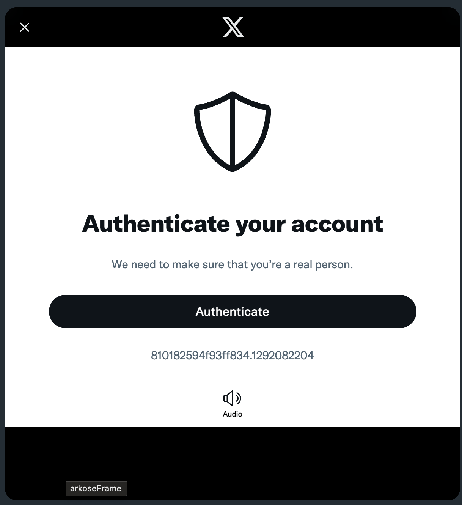
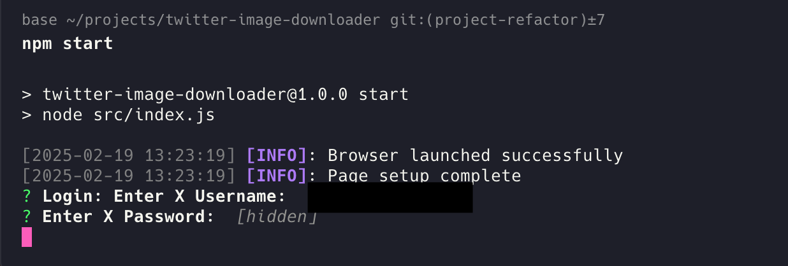
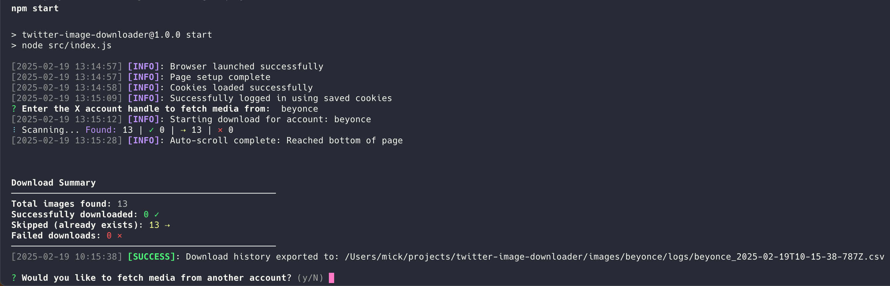

# 🐦 Twitter Timeline Image Downloader

A powerful CLI tool designed for OSINT practitioners to efficiently download media content from Twitter/X profiles.

## ✨ Key Features

- 🔐 Smart Session Management
  - Automated login with cookie persistence
  - Secure credential handling via environment variables
  - Captcha-aware authentication process
- 📸 Efficient Media Scraping
  - Automatic scrolling to load all media
  - Parallel download management
  - Duplicate detection
- 📊 Comprehensive Logging
  - Detailed download statistics
  - CSV export of download history
  - Visual progress tracking
- 🔄 Continuous Operation
  - Multiple account processing in one session
  - Session persistence between runs
  - Graceful error handling

## 🚀 Getting Started

### Prerequisites

- Node.js (v14 or higher)
- npm (comes with Node.js)
- A Twitter/X account

### Installation

1. Clone the repository:
```bash
git clone https://github.com/Kimkykie/twitter-image-downloader.git
cd twitter-image-downloader
```

2. Install dependencies:
```bash
npm install
```

3. Set up your environment:
```bash
cp .env.example .env
```

Edit `.env` with your preferred settings:
```env
TWITTER_USERNAME=your_username  # Optional
TWITTER_PASSWORD=your_password  # Optional
PUPPETEER_HEADLESS=false       # Set to false for first login
```

### ⚠️ Important First-Time Setup

For your first run, ensure `PUPPETEER_HEADLESS=false` in your `.env` file. This is crucial because:

1. Twitter often requires CAPTCHA verification on first login
2. You need to see the browser to complete the verification
3. Once verified, cookies are saved and future runs can be headless



## 💻 Usage

### First Run

1. Start the tool:
```bash
npm start
```

2. If credentials aren't in `.env`, you'll be prompted:


3. After successful login, your session is automatically saved. You won't need to login again until the session expires.

4. Enter the target account handle and wait for downloads to complete.

### Subsequent Runs

1. Start the tool:
```bash
npm start
```

2. The tool automatically uses your saved session - no login needed!

3. Simply enter the target account handle and start downloading.

### During Downloads

- Monitor real-time progress in the terminal
- View download counts (completed/skipped/failed)
- Choose to download from another account when finished

### 📊 Download Reports

After each download, you'll get:
- A summary in the console
- A CSV file with detailed download history
- Images saved in `./images/{username}/`



## 📁 Project Structure
```
twitter-image-downloader/
├── src/
│   ├── config/
│   │   └── config.js         # Configuration setting
│   ├── services/
│   │   ├── authService.js    # Authentication handling
│   │   ├── browserService.js # Browser automation
│   │   └── imageService.js   # Image downloading
│   ├── utils/
│   │   ├── downloadTracker.js  # Download progress and history
│   │   ├── logger.js         # Logging utilities
│   │   └── fileSystem.js     # File operations

│   └── index.js              # Main application
├── images/                    # Downloaded media
├── .env.example              # Environment template
└── package.json              # Dependencies
```

## ⚙️ Configuration Options

| Variable | Description | Default |
|----------|-------------|---------|
| PUPPETEER_HEADLESS | Browser visibility | true |
| TWITTER_USERNAME | X/Twitter username | null |
| TWITTER_PASSWORD | X/Twitter password | null |
| VIEWPORT_WIDTH | Browser width | 1366 |
| VIEWPORT_HEIGHT | Browser height | 768 |

## 🤝 Contributing

Contributions are welcome! Please feel free to submit pull requests.

## ⚠️ Important Notes

### Session Management
- Cookies are stored in `cookies.json`
- Valid cookies = automatic login
- Delete `cookies.json` to force new login

### Rate Limiting
- Tool includes built-in rate limiting
- Respects Twitter's API constraints
- Automatic throttling when needed

### Security
Consider using a dedicated account for scraping to protect your main account.

## 📄 License

[MIT](https://choosealicense.com/licenses/mit/)